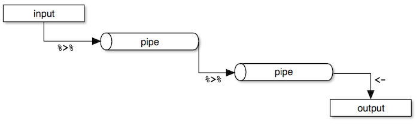
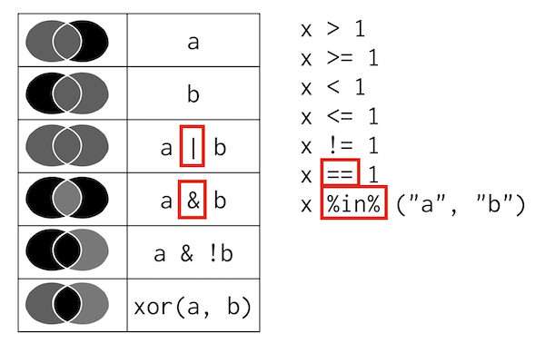

```{r setup, include=FALSE}
knitr::opts_chunk$set(echo = TRUE)
```

The content presented here is somewhat based on the <a href="http://bit.ly/hadley_dplyr_tutorial_2014" target="_blank">tutorial on data manipulation</a> by Hadley Wickham (author of dplyr, tidyr, ggplot, etc). 

### Setup

Run the following script to make sure all necessary packages are installed

```{r message = FALSE}
#source("http://www.ucl.ac.uk/~uctqiax/PUBLG100/setup.R")
```

Now load these packages

```{r message = FALSE}
library(tidyverse)
```

And clear the environment to make sure there are no leftover variables

```{r}
rm(list = ls())
```

### Flights Data

| Dataset | Filename | Description |
|-|-|--------------------------------------------------------------------------------------------------------------------------------------------------|
| flights  | http://ucl.ac.uk/~uctqiax/data/flights.csv | Flight departures from Houston in 2011 |
| weather  | http://ucl.ac.uk/~uctqiax/data/weather.csv | Hourly weather |
| planes   | http://ucl.ac.uk/~uctqiax/data/planes.csv | Metadata for planes |
| airports | http://ucl.ac.uk/~uctqiax/data/airports.csv | Metadata for airports |

We're going to use the `readr` package which provides improved functions for reading datasets from files.

```{r}
flights <- read_csv("http://ucl.ac.uk/~uctqiax/data/flights.csv")
weather <- read_csv("http://ucl.ac.uk/~uctqiax/data/weather.csv")
planes <- read_csv("http://ucl.ac.uk/~uctqiax/data/planes.csv")
airports <- read_csv("http://ucl.ac.uk/~uctqiax/data/airports.csv")
```

You can ignore the warnings from the airport dataset.

### Data pipelines

Dplyr makes it easy to "chain" functions together using the *pipe* operator `%>%`. The following diagram illustrates the general concept of pipes where data flows from one pipe to another until all the processing is completed.



The syntax of the *pipe* operator `%>%` might appear unusual at first, but once you get used to it you'll start to appreciate it's power and flexibility.

Let's start off by examining the flights data 

```{r}
flights
weather
planes
airports
```

Notice that because we used `read_csv()`, the data frame we received now prints nicely without having to use the `head()` function and does not clutter your screen.

Now let's do some simple tasks with `dplyr` using the *pipe* operator

- Select the destination, duration and distance columns (`dest`, `time` and `dist`)

```{r}
flights %>%
  select(dest, time, dist)
```

Add the arrival delay (`arr_delay`) and departure delay (`dep_delay`) columns as well.

```{r}
flights %>%
  select(dest, time, dist, arr_delay, dep_delay)
```

Other ways to do the same

```{r}
flights %>%
  select(dest, time, dist, ends_with("delay"))
```

and ...

```{r}
flights %>%
  select(dest, time, dist, contains("delay"))
```

Select all columns from `date` to `arr`

```{r}
flights %>%
  select(date:arr)
```

Select all *except* `plane` column using the *minus* sign

```{r}
flights %>%
  select(-plane)
```

### Filter

The `filter()` function returns rows with matching conditions. Let's build on the previous exercise and find all flights to Boston (BOS):

```{r}
flights %>%
  select(dest, time, dist) %>%
  filter(dest == "BOS")
```

Now let's do the filter first and then select the columns

```{r}
flights %>%
  filter(dest == "BOS") %>%
  select(dest, time, dist) 
```

In this case the order doesn't matter, but when using pipes make sure you understand that each function is executed in sequence and the results are then fed to the next one.

### Exercise

Find all flights that match the following conditions:

1. To SFO or OAK
1. In January
1. Delayed by more than an hour
1. Departed between midnight and 5am
1. Arrival delay more than twice the departure delay

Here's a brief summary of operators you can use 



Source: <a href="http://bit.ly/hadley_dplyr_tutorial_2014" target="_blank">Hadley Wickham's Dplyr Tutorial</a>

### Arrange

The `arrange()` function is used to sort the rows based on one or more columns

```{r}
flights %>%
  arrange(dest)
```

### Exercise

1. Order flights by departure date and time
1. Which flights were most delayed?
1. Which flights caught up the most time during flight?

### Mutate

The `mutate()` function is used to create new variables.

Up until now we've only been examining the dataset but haven't made any changes to it. All our functions so far have simply displayed the results on screen but haven't created or modified existing variables. Let's see how we can create a new variable called `speed` based on the distance and duration in the flights dataframe.

In this exercise we're adding a new variable to an existing dataframe so we'll just overwrite the `flights` variable with the one that has a `speed` column

```{r}
flights <- flights %>%
  mutate(speed = dist / (time / 60))
```

### Exercise

1. Add a variable to show how much time was made up (or lost) during flight

### Groups

Let's count the number of flights departing each day. 

```{r}
flights %>%
  group_by(date) %>%
  summarise(count = n()) 
```

Here's a nice little trick. You can use `View()` to look at the results of a pipe operation without creating new variables.

```{r}
flights %>%
  group_by(date) %>%
  summarise(count = n()) %>%
  View()
```

Of course, often times we'd want to save the summary in a variable for further analysis.

Let's find the average departure delay for each destination

```{r}
delays <- flights %>%
    group_by(dest) %>%
    summarise(mean = mean(dep_delay))

delays
```

### Exercise

1. What's wrong with the results above, and how would you fix the problem?
1. Can you think of using filter to solve the problem?
1. Use help to find out two other ways to do summarize/n combination in dplyr.
1. How many different destinations can you fly to from Houston?
1. Which destinations have the highest average delays?
1. Which flights (carrier + flight number) happen everyday and where do they fly?
1. How do delays (of non-cancelled flights) vary over the course of a day? 

### Plotting Results

```{r}
hourly <- flights %>%
  filter(cancelled == 0) %>%
  mutate(time = hour + minute / 60) %>%
  group_by(time) %>%
  summarise(
    arr_delay = mean(arr_delay, na.rm = TRUE),
    n = n()
  )

plot(arr_delay ~ time, data = hourly, xaxt = 'n')
axis(1, at = seq(0, 24), las=2)

```

### Merging Multiple Datasets

<a href="http://rpubs.com/altaf/data_merge" target="_blank">Tutorial on Merging Datasets</a>

What if we wanted to see airport delays based on a state or city? We have the airports data that gives us the location of the airport so we can just merge it with the flights data.

```{r}
flights %>%
  group_by(dest) %>%
  filter(!is.na(arr_delay)) %>%
  summarise(delay = mean(arr_delay)) %>%
  arrange(desc(delay)) %>%
  left_join(airports, by = c("dest" = "iata"))
```

### Exercise

1. Are some types of planes more likely to be delayed?
1. Merge the planes dataset with the flights dataset to see if the type/age of plane is associated with delays
1. Join the flights dataset with weather dataset to see how different weather conditions affect flight delay.

### Reshaping

It's fairly common for datasets from public sources to come in wide formats that need to be reshaped. The World Development Indicators (WDI) is one such dataset that requires reshaping before we can analyse it. Let's go over the steps to see how we can reshape the WDI dataset.

We're using a tiny sample of the original WDI dataset here to simplify the tasks. Let's load the dataset and see what it looks like. 

```{r}
wdi <- read_csv("./data/wdi.csv", na = "..")

wdi
```

But ideally, we'd like our data to look something like this:

```{r echo = FALSE}
wdi %>%
  filter(Country.Code != "") %>% 
  gather(Year, Value, starts_with("X")) %>% 
  select(Country.Code, Country.Name, Year, Series.Code, Value) %>%
  spread(Series.Code, Value) %>% 
  rename(CountryName = Country.Name,
         CountryCode = Country.Code,
         MaternalMortality = SH.STA.MMRT,
         HealthExpenditure = SH.XPD.TOTL.ZS) %>%
  mutate(Year = as.numeric(substring(Year, 2, 5)))
```

We can see that some country names and codes are blank, so let's get rid of them first

```{r}
wdi %>%
  filter(Country.Code != "") 
```

So far so good. Note that we're not making any changes yet so we can just add one function at a time to the pipeline and check the results. Once we're satisfied with the results we save them to a variable.

We need to gather all columns that start with "X" that contain per-year values for each series (for example X1960..YR1960)

```{r}
wdi %>%
  filter(Country.Code != "") %>% 
  gather(Year, Value, starts_with("X"))
```

Now all values are in the `Value` column, so we need to spread them out to individual columns based on the `Series.Code`. We have to make sure that we only keep the columns that  make the country-year observations unique. We use `select()` to keep `Country.Code`, `Country.Name`, `Year`, plus the two columns (`Series.Code` and `Value`) that will make up the key-value pair for the `spread()` function.

```{r}
wdi %>%
  filter(Country.Code != "") %>% 
  gather(Year, Value, starts_with("X")) %>% 
  select(Country.Code, Country.Name, Year, Series.Code, Value) %>%
  spread(Series.Code, Value) 
```

It looks good, so we can rename the variables to something meaningful.

```{r}
wdi %>%
  filter(Country.Code != "") %>% 
  gather(Year, Value, starts_with("X")) %>% 
  select(Country.Code, Country.Name, Year, Series.Code, Value) %>%
  spread(Series.Code, Value) %>% 
  rename(CountryName = Country.Name,
         CountryCode = Country.Code,
         MaternalMortality = SH.STA.MMRT,
         HealthExpenditure = SH.XPD.TOTL.ZS)
```

Now we just need to extract the 4-digit year from the `Year` column. The `Year` column is formatted as `X1995.YR1995` which means that the 4-digits for the year are in position `2`,`3`,`4`, and `5`. We can use the `substring()` function to take all the characters from position `2` to `5` and assign it back to the `Year` column.

Since this is the last step we might as well assign the results to a new variable.

```{r}
wdi_long <- wdi %>%
  filter(Country.Code != "") %>% 
  gather(Year, Value, starts_with("X")) %>% 
  select(Country.Code, Country.Name, Year, Series.Code, Value) %>%
  spread(Series.Code, Value) %>% 
  rename(CountryName = Country.Name,
         CountryCode = Country.Code,
         MaternalMortality = SH.STA.MMRT,
         HealthExpenditure = SH.XPD.TOTL.ZS) %>%
  mutate(Year = as.numeric(substring(Year, 2, 5)))

wdi_long 
```

You can assign it back to `wdi` if you want, but we're using a different name in case we make a mistake and have to start again. This way we would've have to reload the file all over again.

### Resources

##### Online Books
1. <a href="http://r4ds.had.co.nz" target="_blank">R for Data Science</a>
1. <a href="http://adv-r.had.co.nz" target="_blank">Advanced R</a>

##### Cheat Sheets

1. [RStudio (PDF)](http://www.rstudio.com/wp-content/uploads/2016/01/rstudio-IDE-cheatsheet.pdf)
1. [Data Wrangling with dplyr and tidyr (PDF)](https://www.rstudio.com/wp-content/uploads/2015/02/data-wrangling-cheatsheet.pdf)
1. [Data Visualization with ggplot2 (PDF)](http://www.rstudio.com/wp-content/uploads/2015/12/ggplot2-cheatsheet-2.0.pdf)

